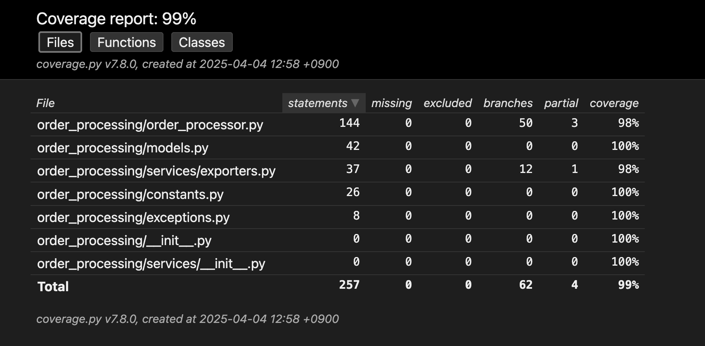
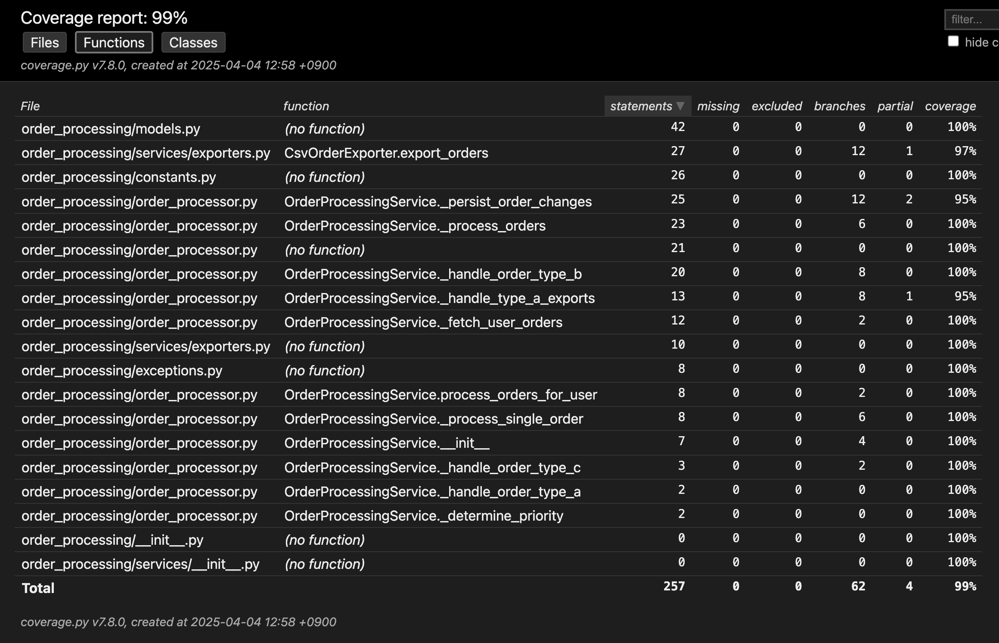
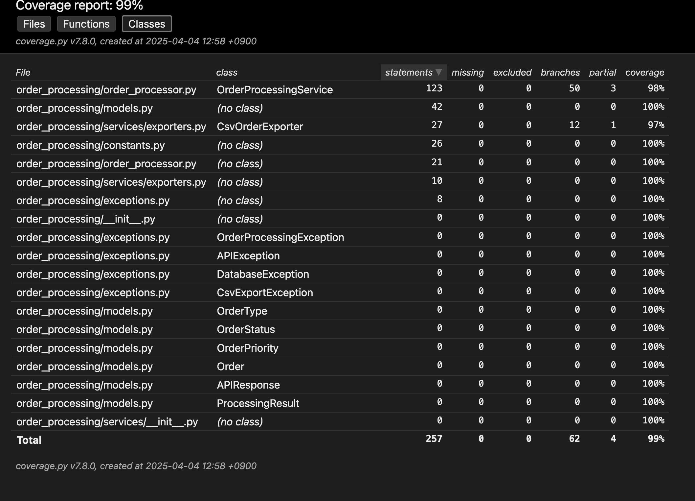

# Unit Testing Assignment: Order Processing Service

This is the submission for the requirement to write Unit Tests for the order processing functionality.

## Overview of the System Under Test

The system under test is an Order Processing Service (`OrderProcessingService`) written in Python. Its main functionalities include:

1. Fetching a list of orders for a user from the Database.
2. Processing each order based on its type (`A`, `B`, `C`, or unknown).
3. Calling an external API for orders of type `B`.
4. Exporting orders of type `A` to a CSV file.
5. Updating the status (`status`) and priority (`priority`) for each order.
6. Persisting these changes back to the Database.

The provided source code has been refactored from the original `order.py` file into an `order_processing` package, adhering better to SOLID principles (especially Dependency Inversion and Single Responsibility) to facilitate unit testing.

## Project Structure and File Descriptions

Here is the structure of the project submission and the purpose of each key file/directory:

```
.
├── .gitignore             # Specifies intentionally untracked files that Git should ignore.
├── CHECKLIST.md           # ASSIGNMENT REQUIREMENT: The checklist of test cases prepared before writing tests.
├── order.py               # The original, single-file version of the order processing logic (provided for context).
├── order_processing/      # The main Python package containing the refactored application logic BEING TESTED.
│   ├── __init__.py        # Makes 'order_processing' a Python package.
│   ├── config.py          # Contains configuration, like logging setup.
│   ├── exceptions.py      # Defines custom exceptions used within the application.
│   ├── interfaces.py      # Defines Abstract Base Classes (interfaces) for external services (DatabaseService, APIClient). Crucial for mocking.
│   ├── main.py            # An example script showing how to set up and run the OrderProcessingService with mock dependencies.
│   ├── models.py          # Defines data structures/models used by the application (Order, APIResponse, ProcessingResult) using dataclasses.
│   ├── order_processor.py # *** CORE FILE UNDER TEST *** Contains the OrderProcessingService class and its logic.
│   └── services/          # Contains concrete implementations (mocks provided) of the service interfaces.
│       ├── __init__.py    # Makes 'services' a Python sub-package.
│       ├── api_client.py  # Contains MockApiClient, a sample implementation of APIClient.
│       ├── database.py    # Contains InMemoryDbService, a sample implementation of DatabaseService.
│       └── exporters.py   # Contains CsvOrderExporter, a concrete class used by OrderProcessingService (mocked in tests).
├── pytest.ini             # Configuration file for pytest, including test discovery paths and coverage settings.
├── README.md              # This file, explaining the assignment submission.
├── requirements.txt       # Lists the Python dependencies required to run the tests (pytest, pytest-cov, coverage).
├── REVIEW-CRITERIA.md     # ASSIGNMENT REQUIREMENT: The evaluation criteria for this assignment.
├── tests/                 # Directory containing the unit tests for the assignment.
│   └── test_order.py      # *** ASSIGNMENT SUBMISSION *** The file containing the pytest unit tests written for OrderProcessingService.
└── tools/                 # Contains utility scripts.
    └── clean_test_cache.py # A helper script to clean pytest cache files.

```

## Understanding the Order Processing Service Refactoring & Tests

### Original Code: order.py

This file represents the **original implementation** with several characteristics that made testing difficult:

- **Monolithic design**: All functionality in a single file with tight coupling
- **Direct concrete implementations**: No interfaces or dependency injection
- **Hard-to-mock dependencies**: Direct file I/O and API calls
- **Limited error handling**: Basic exception handling
- **Mixed responsibilities**: Processing, data access, and export logic mixed together

### Refactored Code: order_processing package

The refactored code demonstrates several software engineering best practices:

- **Package structure**: Organized into modules with clear responsibilities
- **Dependency injection**: External services passed as constructor parameters
- **Interface abstractions**: Abstract base classes in interfaces.py defining contracts
- **Improved error handling**: More granular exception types and handling
- **Single Responsibility Principle**: Separate classes for different concerns
- **More testable design**: All external dependencies can be easily mocked

### Unit Tests: test_order_processor.py

Unit Test based on the refactored code, focusing on the `OrderProcessingService` class. The tests cover:
My tests leverage the improved design to achieve high coverage:

- **Comprehensive test suite**: 43 passing tests covering different scenarios
- **Mock objects**: Using `unittest.mock` to isolate the system under test
- **Parametrized tests**: For testing boundary conditions
- **Test fixtures**: Reusable test setup via pytest fixtures
- **High coverage**: 99% overall with only 4 branch conditions not fully covered

## Key Improvements That Enhanced Testability

1. **Interfaces and DI**: By defining interfaces and using dependency injection, I can easily substitute mock implementations for testing
2. **Clear separation of concerns**: The refactored code separates business logic from external dependencies
3. **Better error handling**: More specific exception types make error cases testable
4. **Pure functions**: Many methods have clearer inputs and outputs, making assertions easier
5. **Consistent status handling**: Using constants instead of magic strings improves test readability

## Evaluation Criteria Met

This submission attempts to meet the specified evaluation criteria:

- **[x] Checklist (Test Cases):** The `CHECKLIST.md` file contains the list of test cases identified before writing the test code.
- **[x] Code Coverage:** `pytest-cov` was used to measure and ensure high code coverage. The goal was full coverage of lines, conditions, and branches within the main processing logic (`order_processing/order_processor.py`).
- **[x] Full Line, Condition, Branch Coverage:** The detailed coverage results (see **Coverage Evidence** section) show that critical parts of `OrderProcessingService` have been tested.
- **[x] Adherence to Best Practices & Clean Code:** The test code in `tests/test_order.py` uses `pytest` and common mocking techniques, aiming for clarity, readability, and maintainability.
- **[x] Verifiable Unit Test Results:** All test cases include clear `assert` statements to verify expected outcomes (order statuses, return values, mock calls).

### Notes on Implementation

- **Use of Mock/Stub:** External dependencies such as `DatabaseService`, `APIClient`, `CsvOrderExporter` (including file I/O), and `time.time` have been mocked using `unittest.mock` (via `pytest` fixtures or `patch`) to isolate `OrderProcessingService` during testing.
- **Code Fixes and Refactoring:** The unit tests were written against the refactored code version within the `order_processing` package, which already improved the structure and testability compared to the original `order.py` file.

## Submission Directory Structure

- `order_processing/`: Directory containing the source code of the order processing service (refactored).
- `tests/`: Directory containing the unit test code.
  - `test_order.py`: The main unit test file using `pytest`.
- `CHECKLIST.md`: The test case checklist file.
- `REVIEW-CRITERIA.md`: The evaluation criteria file (provided in the assignment).
- `requirements.txt`: List of necessary Python libraries (`pytest`, `pytest-cov`, `coverage`).
- `pytest.ini`: Configuration file for `pytest`, including coverage settings.
- `README.md`: This file.
- *(Optional)* `htmlcov/` or coverage report file (`coverage.xml`): Detailed results of the code coverage measurement.

## How to Run Unit Tests and View Coverage

1. **Set up environment:**

    ```bash
    python -m venv venv
    # Windows
    .\venv\Scripts\activate
    # macOS/Linux
    source venv/bin/activate
    ```

2. **Install dependencies:**

    ```bash
    pip install -r requirements.txt
    ```

3. **Run Unit Tests:**

    ```bash
    pytest -v
    ```

4. **Run Unit Tests and View Coverage in Terminal:**

    ```bash
    pytest --cov=order_processing
    ```

5. **(Optional) Generate HTML Coverage Report:**

    ```bash
    pytest --cov=order_processing --cov-report=html
    ```

    Open the `htmlcov/index.html` file in your browser to view the detailed report.

## Coverage Evidence

> Below are screenshots showing the coverage results run in the terminal:
>
> *(Insert screenshot(s) of the `pytest --cov=order_processing` command output here)*
>
> ```
> ============================================================================= tests coverage =============================================================================
> ____________________________________________________________ coverage: platform darwin, python 3.12.4-final-0 ____________________________________________________________
>
> Name                                     Stmts   Miss Branch BrPart  Cover   Missing
> ------------------------------------------------------------------------------------
> order_processing/__init__.py                 0      0      0      0   100%
> order_processing/constants.py               26      0      0      0   100%
> order_processing/exceptions.py               8      0      0      0   100%
> order_processing/models.py                  42      0      0      0   100%
> order_processing/order_processor.py        144      0     50      3    98%   210->202, 254->253, 263->262
> order_processing/services/__init__.py        0      0      0      0   100%
> order_processing/services/exporters.py      37      0     12      1    98%   82->81
> ------------------------------------------------------------------------------------
> TOTAL                                      257      0     62      4    99%
> Coverage HTML written to dir htmlcov
> =========================================================================== 43 passed in 0.25s ===========================================================================
> > ```
>



---
